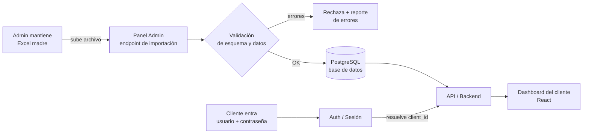

# Portal de Clientes — Fondo de Inversión Privado
## Documento Técnico Funcional (v1 — MVP)

> **Objetivo del documento:** que un desarrollador entienda exactamente qué hay que construir, con qué tecnología, con qué reglas de datos y con qué prioridades. El enfoque es **MVP prolijo, seguro y escalable**: que funcione bien con pocos clientes y que pueda crecer sin reescribir todo.

---

## 1. Resumen ejecutivo y decisión clave

Estamos construyendo una **app web de solo lectura para clientes** de un fondo de inversión. Cada cliente entra con usuario y contraseña y ve **únicamente su propia información**: valor de la cuotaparte, sus cuotapartes, el valor de su inversión, su evolución histórica y la composición del fondo.

**La decisión más importante del proyecto:**

> El Excel **NO** debe ser la base de datos que la app lee en tiempo real. El Excel debe ser el **archivo de carga** (la fuente que mantiene el administrador), y un proceso de importación valida y vuelca esa información a una **base de datos real**. La app sirve a los clientes desde la base de datos, nunca desde el Excel.

Esto se explica en detalle en la sección 3, pero el resumen es: Excel no maneja accesos simultáneos, no valida tipos de datos, no permite control de acceso por fila, no se puede auditar bien y se corrompe con facilidad. Para datos financieros sensibles es un riesgo inaceptable como motor en producción. En cambio, **como herramienta de carga para el administrador es perfecto**, porque ya está acostumbrado a usarlo.

Patrón recomendado: **Excel (carga) → Validación/Importación → Base de datos (PostgreSQL) → App.**

---

## 2. Arquitectura general



**Capas:**

1. **Capa de carga (Excel + importación):** el administrador edita el Excel madre offline y lo sube por el panel admin. El backend lo valida y, si pasa, lo importa a la base de datos dentro de una transacción. Si falla, no se modifica nada y devuelve un reporte de errores.
2. **Capa de datos (PostgreSQL):** fuente de verdad en runtime. Normalizada, indexada, con backups automáticos y registro de auditoría.
3. **Capa de backend (API):** autentica al usuario, resuelve **a qué cliente pertenece la sesión**, y devuelve **solo** los datos de ese cliente. Toda la autorización se hace acá, del lado del servidor.
4. **Capa de frontend (dashboard):** muestra cards, gráficos y tablas. Es "tonto" en seguridad: nunca decide qué puede ver el usuario; solo pinta lo que el backend ya filtró.

**Principio rector:** el frontend es no confiable. Toda decisión de "qué datos puede ver este usuario" se toma en el backend a partir de la sesión, nunca de un parámetro que mande el navegador.

---

## 3. Excel: ¿base de datos o archivo de carga?

**Recomendación firme: Excel como archivo de carga, base de datos real para producción.**

| Criterio | Excel leído en vivo | Excel → BD (recomendado) |
|---|---|---|
| Accesos simultáneos | Se corrompe / bloquea | Sin problema |
| Validación de datos | Nula (un dato mal y rompe) | Validación al importar |
| Control de acceso por cliente | Casi imposible de garantizar | Filtrado por consulta |
| Velocidad al crecer | Cada vez más lento | Indexado, rápido |
| Auditoría (quién cambió qué) | Difícil | Registro de importaciones |
| Backups / recuperación | Manual y frágil | Automático |
| Riesgo de fuga | Un archivo = todos los clientes | Aislamiento por fila |

**Conclusión:** el administrador sigue trabajando en Excel (cero fricción para él), pero la app nunca lo lee directo. Un proceso de importación lo transforma en datos confiables. Lo mejor de los dos mundos.

> Importante para la fase 2: a medida que el fondo crezca, conviene migrar la carga del Excel a un **panel de administración con formularios** (ver sección 7), pero eso no es necesario para el MVP.

---

## 4. Stack tecnológico recomendado

Stack simple, profesional, con un solo desarrollador en mente y pensado para escalar.

| Pieza | Recomendación | Por qué |
|---|---|---|
| **Frontend + Backend** | **Next.js (React + TypeScript)** | Un solo proyecto para UI y API. Menos infraestructura, despliegue simple. TypeScript reduce errores. |
| **Base de datos** | **PostgreSQL administrado** (Supabase, Neon o Railway) | Robusto, gratis/barato al inicio, escala sin migrar de motor. |
| **ORM / acceso a datos** | **Prisma** | Esquema tipado, migraciones versionadas, consultas seguras. |
| **Autenticación** | **Proveedor administrado** (Supabase Auth, Auth0 o Clerk) | Para datos financieros **no conviene hacer auth a mano**. Trae hashing, sesiones y 2FA probados. |
| **Procesamiento de Excel** | **SheetJS (`xlsx`)** o **ExcelJS** en el backend | Lee `.xlsx` de forma confiable en Node. |
| **Gráficos** | **Recharts** | Simple, declarativo, ideal para líneas, torta y barras. |
| **Hosting** | **Vercel** (app) + base administrada | Despliegue automático, HTTPS por defecto, sin servidores que mantener. |

**Alternativa válida** (si el desarrollador es de perfil Python): backend en **FastAPI** + **pandas/openpyxl** para el Excel + **React** en el frontend + **PostgreSQL**. Funciona igual de bien; la recomendación de Next.js es solo por simplicidad de tener un único stack.

**Reglas de seguridad transversales del stack:**
- HTTPS siempre (lo da Vercel).
- Contraseñas **nunca** en texto plano ni en el Excel (las maneja el proveedor de auth, con hashing).
- Secretos (claves de BD, etc.) en variables de entorno, nunca en el código.

---

## 5. Estructura ideal del Excel (para que la app lo lea sin errores)

El error más común es el que vos planteaste: **"una hoja por cliente"**. Eso no escala, es frágil y mezcla estructura con datos. La forma correcta es **datos tabulares normalizados**: cada hoja es una tabla plana con una fila de encabezado y una fila por registro.

**Reglas generales del archivo:**
- Una fila de encabezados, nombres de columna en `snake_case`, sin tildes ni espacios.
- Fechas en formato **ISO `AAAA-MM-DD`**.
- Números como números (sin "$", sin separadores de miles como texto).
- **Sin celdas combinadas, sin filas en blanco intermedias, sin colores como dato.**
- **Nunca** una columna de contraseña. La identidad del cliente se vincula por su `email` o `cliente_id`.

### Hoja `fondo` — metadatos generales (1 fila por fecha de corte)
| columna | tipo | ejemplo |
|---|---|---|
| fecha | fecha | 2026-06-30 |
| valor_total_fondo | número | 15000000.00 |
| cuotapartes_totales | número | 100000.0000 |
| valor_cuotaparte | número | 150.0000 |

### Hoja `valor_cuotaparte` — histórico de la cuotaparte (1 fila por fecha)
| columna | tipo | ejemplo |
|---|---|---|
| fecha | fecha | 2026-06-30 |
| valor_cuotaparte | número | 150.0000 |

### Hoja `posiciones` — posiciones actuales del fondo (1 fila por activo)
| columna | tipo | ejemplo |
|---|---|---|
| fecha | fecha | 2026-06-30 |
| ticker | texto | AAPL |
| nombre | texto | Apple Inc. |
| tipo_instrumento | texto | accion \| etf \| bono \| opcion |
| sector | texto | Tecnología |
| cantidad | número | 500 |
| precio | número | 210.50 |
| valor_mercado | número | 105250.00 |

### Hoja `clientes` — registro de clientes (1 fila por cliente)
| columna | tipo | ejemplo |
|---|---|---|
| cliente_id | texto/único | CLI-0001 |
| nombre | texto | Juan Pérez |
| email | texto/único | juan@correo.com |
| activo | sí/no | si |

### Hoja `movimientos` — aportes y retiros (1 fila por movimiento)
| columna | tipo | ejemplo |
|---|---|---|
| cliente_id | texto | CLI-0001 |
| fecha | fecha | 2026-01-15 |
| tipo | texto | aporte \| retiro |
| monto | número | 50000.00 |
| cuotapartes | número | 333.3333 |

### 💡 La clave de precisión que evita errores

No mantengas a mano la "evolución histórica de cada cliente" ni su "valor actual": **la app lo calcula.**

- **Cuotapartes que tiene un cliente** = suma de cuotapartes de sus aportes − retiros.
- **Valor de su inversión en una fecha t** = `cuotapartes_del_cliente(t) × valor_cuotaparte(t)`.
- **Evolución de su inversión** = ese cálculo aplicado sobre el histórico de la cuotaparte.
- **Ganancia simple** = valor actual − aportes netos (aportes − retiros).

Esto significa que el administrador solo mantiene **el histórico de la cuotaparte** (a nivel fondo) y **los movimientos de cada cliente**. Todo lo demás se deriva. Menos celdas para equivocarse = menos errores = datos más confiables.

> **Nota sobre rentabilidad:** una rentabilidad "porcentual" simple es engañosa cuando hay aportes y retiros en distintos momentos. Para el MVP mostramos *valor actual*, *aportes netos* y *ganancia en pesos*. El cálculo correcto de rentabilidad con flujos (Time-Weighted Return) queda para la fase 2.

---

## 6. Modelo de base de datos relacional (destino del Excel)

Esquema sugerido (PostgreSQL). Es a donde se importa el Excel y desde donde lee la app.

```
users                         -- gestionado por el proveedor de auth
  id (uuid, PK)
  email (único)
  role (cliente | admin)
  -- la contraseña la maneja el proveedor de auth, NO esta tabla

clients
  id (PK)
  user_id (FK -> users.id)    -- vincula la cuenta de login con el cliente
  cliente_id (texto, único)   -- el del Excel (CLI-0001)
  nombre
  activo (bool)
  created_at

fund_nav                      -- valor de la cuotaparte en el tiempo
  id (PK)
  fecha (date, único)
  valor_cuotaparte (numeric)

fund_snapshot                 -- metadatos del fondo por fecha
  id (PK)
  fecha (date, único)
  valor_total_fondo (numeric)
  cuotapartes_totales (numeric)

positions                     -- posiciones del fondo por fecha
  id (PK)
  fecha (date)
  ticker, nombre
  tipo_instrumento, sector
  cantidad (numeric)
  precio (numeric)
  valor_mercado (numeric)

client_movements              -- aportes/retiros
  id (PK)
  client_id (FK -> clients.id)
  fecha (date)
  tipo (aporte | retiro)
  monto (numeric)
  cuotapartes (numeric)

import_batches                -- AUDITORÍA de cada importación
  id (PK)
  archivo_nombre
  importado_por (FK -> users.id)
  importado_en (timestamp)
  filas_procesadas (int)
  estado (ok | error)
  detalle (json)
```

**Índices clave:** `client_movements(client_id, fecha)`, `fund_nav(fecha)`, `positions(fecha)`.
**Regla de oro:** el rol `cliente` **no tiene permisos de escritura** sobre ninguna tabla financiera. Solo lee, y solo lo suyo.

---

## 7. Módulos principales de la app

1. **Login.** Email + contraseña vía proveedor de auth. Sesión segura (cookie httpOnly). Bloqueo tras intentos fallidos. 2FA recomendado (fase 2 si hace falta acelerar).
2. **Dashboard del cliente.** Solo lectura. Cards, gráficos y tablas con datos del cliente autenticado (ver sección 8).
3. **Panel administrador.** Acceso restringido al rol `admin`. En el MVP: subir el Excel, ver el resultado de la importación y ver la lista de clientes. En fase 2: edición por formularios.
4. **Carga / actualización del Excel.** Sube `.xlsx` → valida esquema y datos → importa en una **transacción** (todo o nada) → registra el resultado en `import_batches`. Si algo falla, no toca la base y devuelve qué fila/columna está mal.
5. **Visualización de posiciones.** Tabla + gráficos de composición del fondo (es información a nivel fondo, igual para todos los clientes).
6. **Visualización de cuotapartes.** Cantidad del cliente, valor de la cuotaparte y evolución.
7. **Reportes.** MVP: ver en pantalla. Fase 2: exportar PDF del estado de cuenta.
8. **Seguridad.** Transversal: autenticación, autorización por cliente, HTTPS, logs de acceso, manejo de secretos. (Ver secciones 9 y 10.)

---

## 8. Diseño del dashboard del cliente

**Organización visual (de arriba hacia abajo):**

**Fila 1 — Cards (KPIs principales):**
- **Valor actual de tu inversión** — el número grande, protagonista (ej. $X).
- **Valor de la cuotaparte hoy** — con variación respecto al período anterior (ej. $150,00 ▲ +2,1%).
- **Tus cuotapartes** — cantidad que posee.
- **Resultado acumulado** — valor actual − aportes netos, en pesos y opcionalmente en %.

**Fila 2 — Gráficos (2 columnas):**
- **Línea: evolución de tu inversión** en el tiempo.
- **Torta/dona: composición del fondo** por tipo de instrumento (o por sector, con un selector).

**Fila 3 — Gráficos secundarios:**
- **Línea: evolución del valor de la cuotaparte.**
- **Barras: principales posiciones del fondo** por valor de mercado.

**Fila 4 — Tablas:**
- **Posiciones actuales del fondo** (ticker, nombre, tipo, sector, % del fondo).
- **Tus movimientos** (fecha, tipo, monto) — opcional en MVP, recomendado.

**Pautas de diseño:** layout responsive (se ve bien en celular), una sola columna en mobile, cards arriba siempre visibles, fecha de última actualización visible en el encabezado ("Datos al 30/06/2026") para que el cliente sepa que la información tiene un corte.

---

## 9. Cómo asegurar que cada cliente solo vea lo suyo

Esto es lo más crítico del proyecto. Defensa en capas:

1. **El servidor resuelve la identidad, no el cliente.** Al loguearse, la sesión guarda el `user_id`. El backend traduce eso a un `client_id`. **Nunca** se confía en un `client_id` que venga del navegador (ni en la URL, ni en el body, ni en un header).

   ```
   ❌ MAL:  GET /api/inversion?cliente=CLI-0002   (el usuario podría cambiarlo)
   ✅ BIEN: GET /api/mi-inversion                 (el server saca el client_id de la sesión)
   ```

2. **Toda consulta financiera va filtrada por ese `client_id`.** No existe una consulta "traé todo" que el frontend filtre después.

3. **Sin enumeración de IDs.** No exponer endpoints donde cambiar un número devuelva los datos de otro cliente.

4. **Row-Level Security (si usás Supabase).** Activar políticas RLS para que, aunque haya un bug en la API, la base **físicamente** no devuelva filas de otro cliente.

5. **Información a nivel fondo vs a nivel cliente.** Posiciones, composición y valor de la cuotaparte son del fondo (iguales para todos, no son secretas entre clientes). Cuotapartes, movimientos y valor de la inversión son **privados de cada cliente**. Tratar cada tipo según corresponde.

---

## 10. Riesgos y mitigaciones

| Riesgo | Mitigación |
|---|---|
| **Seguridad / auth** | Proveedor de auth probado, contraseñas hasheadas, HTTPS, cookies httpOnly, bloqueo por intentos, 2FA en fase 2. |
| **Errores en el Excel** | Validación de esquema y tipos al importar. Importación transaccional (todo o nada). Reporte de errores por fila/columna. Vista previa antes de confirmar (fase 2). |
| **Datos sensibles** | Mínimos datos necesarios, cifrado en reposo (lo da el proveedor de BD), logs de acceso, sin datos financieros en logs. Considerar la **Ley 25.326 de Protección de Datos Personales** (Argentina) y consultar con un asesor legal/compliance sobre residencia de datos y regulación del fondo (CNV). |
| **Escalabilidad** | Base relacional indexada desde el día uno. El modelo normalizado (no una hoja por cliente) crece sin reescrituras. |
| **Control de accesos** | Roles `cliente`/`admin`. Cliente solo lectura de lo suyo. Autorización en el servidor (sección 9). |
| **Backups** | Backups automáticos diarios de la BD (los dan los proveedores administrados) + **guardar cada Excel importado versionado** con fecha. |
| **Auditoría de cambios** | Tabla `import_batches`: quién importó, cuándo, cuántas filas, resultado. Registro de logins. |

---

## 11. Alcance del MVP

**✅ Entra en la primera versión:**
- Login con email + contraseña (proveedor de auth, contraseñas hasheadas).
- Dashboard del cliente: las 4 cards, gráfico de evolución de la inversión, gráfico de composición del fondo, tabla de posiciones.
- Aislamiento estricto por cliente (sección 9).
- Carga del Excel por el admin → validación → importación transaccional → registro en `import_batches`.
- HTTPS, backups automáticos de BD, versionado de los Excel importados.

**⏭️ Fase 2 (después de que funcione lo básico):**
- 2FA.
- Panel admin con edición por formularios (reemplazar la carga por Excel progresivamente).
- Exportación de estado de cuenta en PDF.
- Cálculo correcto de rentabilidad con flujos (TWR), comparación con benchmarks.
- Gráficos adicionales y filtros (por sector, por período).
- Notificaciones por email cuando hay actualización.

**🚫 Qué evitar al principio (para no complicar el desarrollo):**
- Leer el Excel en vivo en cada request (es el antipatrón central).
- Hacer la autenticación a mano.
- Un panel admin CRUD completo desde el día uno.
- Datos en tiempo real / precios en vivo.
- Analítica compleja de opciones (Griegas, etc.).
- Microservicios. Un único proyecto Next.js sobra para arrancar.

---

## 12. Flujo paso a paso (end-to-end)

1. **El administrador actualiza el Excel madre** offline, respetando la estructura de la sección 5 (corte de fecha, NAV, posiciones, movimientos).
2. **Lo sube por el panel admin.** El backend lo recibe.
3. **La app valida** el esquema y los datos. Si hay errores, **rechaza todo** y devuelve un reporte (hoja, fila, columna, motivo). No se modifica nada.
4. **Si está OK, importa en una transacción:** actualiza `fund_nav`, `positions`, `client_movements`, etc. Guarda una fila en `import_batches` (quién, cuándo, cuántas filas, OK). Archiva el Excel versionado.
5. **El cliente entra** con su usuario y contraseña.
6. **El backend valida la sesión** y resuelve el `client_id` correspondiente desde el servidor.
7. **La app consulta solo los datos de ese cliente** (movimientos → cuotapartes → valor) + los datos públicos del fondo (NAV, posiciones), y calcula su valor actual y su evolución.
8. **El frontend renderiza** las cards, gráficos y tablas con esa información ya filtrada. El cliente nunca recibe datos de otros clientes.

---

## 13. Notas para el desarrollador (criterios de aceptación)

- [ ] Un cliente autenticado **no puede** ver datos de otro, ni siquiera manipulando URLs o requests.
- [ ] La app **no lee el Excel en runtime**; lo consume vía importación a PostgreSQL.
- [ ] La importación es **transaccional**: o entra todo o no entra nada.
- [ ] Un Excel mal formado produce un **reporte de errores claro**, no una caída ni datos a medias.
- [ ] Las contraseñas están **hasheadas** y no aparecen en el Excel ni en ningún log.
- [ ] El valor de la inversión y la evolución del cliente se **calculan** a partir de NAV + movimientos (no se cargan a mano).
- [ ] HTTPS activo, secretos en variables de entorno, backups automáticos configurados.
- [ ] Cada importación queda registrada en `import_batches` (auditoría).
- [ ] El dashboard muestra la **fecha del último corte** de datos de forma visible.

**Primeros pasos sugeridos para el desarrollador:**
1. Definir el esquema en Prisma y crear la BD PostgreSQL administrada.
2. Configurar el proveedor de auth y el flujo de login + sesión.
3. Implementar el importador de Excel (validación + transacción + auditoría) con un archivo de ejemplo.
4. Construir los endpoints de "mi inversión" / "datos del fondo" scopeados por sesión.
5. Maquetar el dashboard con Recharts sobre datos reales importados.
6. Probar el aislamiento por cliente con dos cuentas distintas antes de salir.
